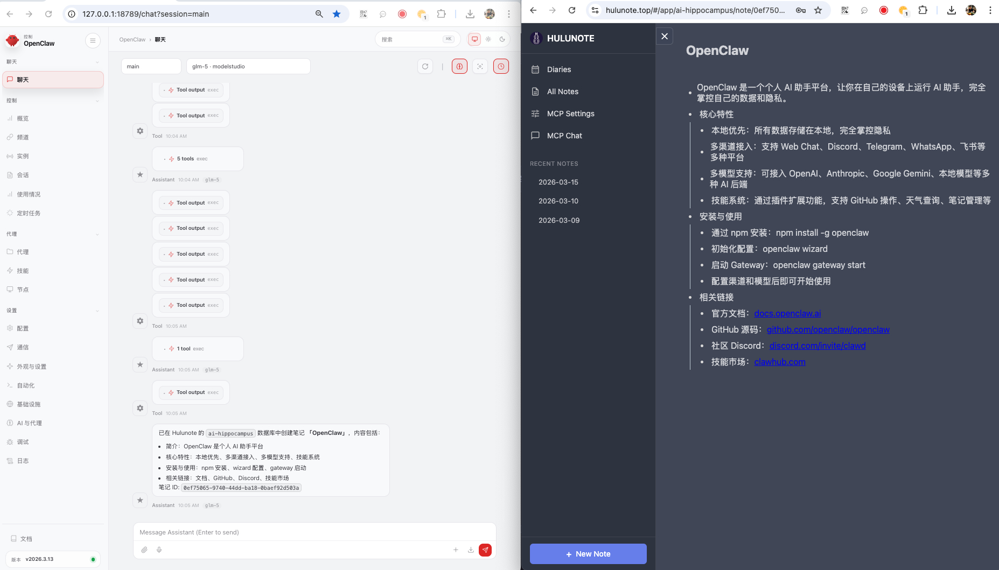

# Hulunote Assistant

OpenClaw plugin for managing [Hulunote](https://www.hulunote.top) notes — browse databases, read and write notes, and manage outlines.



## Installation

```bash
openclaw plugins install --link /path/to/openclaw-hulunote-assistant
```

After installation, restart the gateway to load the plugin:

```bash
openclaw gateway restart
```

## Configuration

Add to your OpenClaw config (`~/.openclaw/openclaw.json`):

```json
{
  "plugins": {
    "entries": {
      "hulunote-assistant": {
        "enabled": true,
        "config": {
          "serverUrl": "https://www.hulunote.top",
          "token": "your-jwt-token-here",
          "defaultDatabaseId": "your-default-database-id"
        }
      }
    }
  }
}
```

### Config options

| Option | Type | Description |
|--------|------|-------------|
| `serverUrl` | string | Hulunote server URL. Defaults to `http://localhost:6689`. Use `https://www.hulunote.top` for the hosted service. |
| `token` | string | Hulunote JWT token (from `x-functor-api-token` header). Takes priority over `tokenEnv`. |
| `tokenEnv` | string | Environment variable name containing the token (e.g. `HULUNOTE_API_TOKEN`). Used when `token` is not set. |
| `defaultDatabaseId` | string | Default database ID, so you don't have to specify it every time. |

## Setup

1. Log in to [Hulunote](https://www.hulunote.top) and obtain your JWT token (the `x-functor-api-token` value from browser network requests)
2. Install the plugin: `openclaw plugins install --link /path/to/openclaw-hulunote-assistant`
3. Configure the plugin in `~/.openclaw/openclaw.json` with your `serverUrl` and `token` (see above)
4. Restart the gateway: `openclaw gateway restart`
5. Verify the plugin is loaded: `openclaw plugins list`

## Tools

| Tool | Description |
|------|-------------|
| `hulunote_list_databases` | List all databases for the authenticated user |
| `hulunote_list_notes` | List notes in a database (paginated) |
| `hulunote_read_note` | Read a note's full outline as indented text |
| `hulunote_search_notes` | Search notes by title across databases |
| `hulunote_create_note` | Create a new note |
| `hulunote_add_outline_node` | Add an outline node to a note |
| `hulunote_update_outline_node` | Update an outline node's content |
| `hulunote_delete_outline_node` | Delete an outline node |

## Skills

- **note-reading** — Triggered when users ask to read, browse, or find notes
- **note-writing** — Triggered when users ask to create or edit notes

## API Authentication

This plugin uses the `x-functor-api-token` header for authentication with the Hulunote API. The token is a JWT issued upon login.
